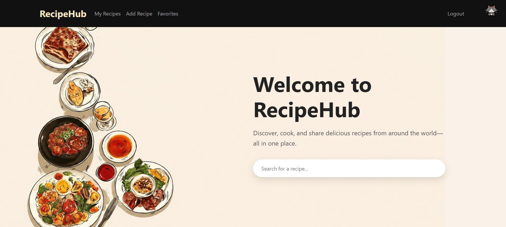
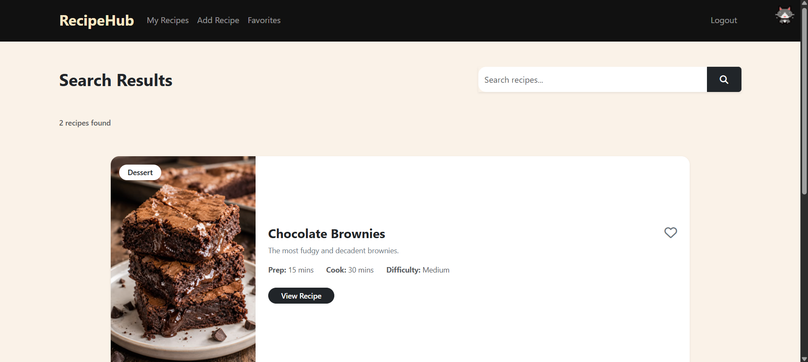
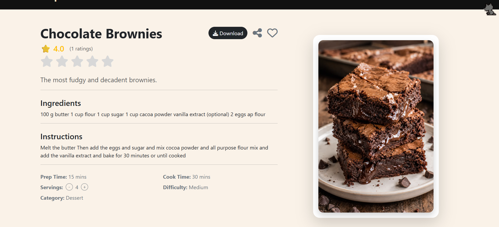
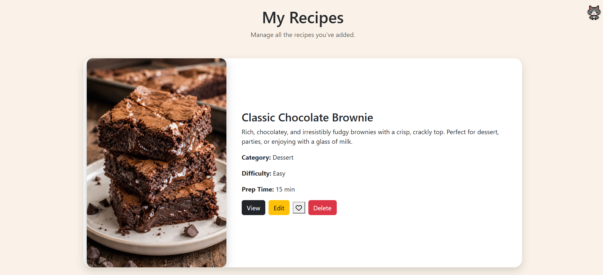
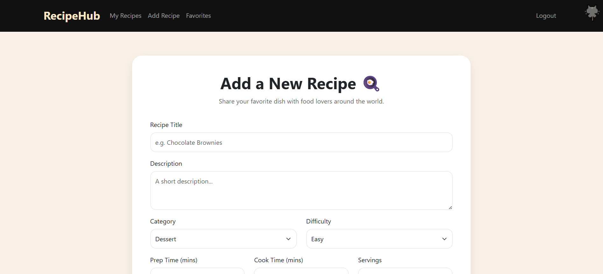
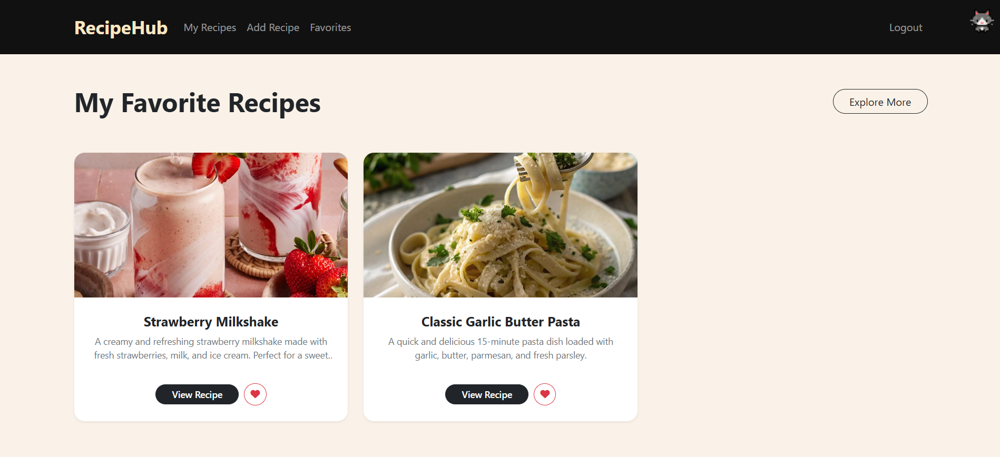
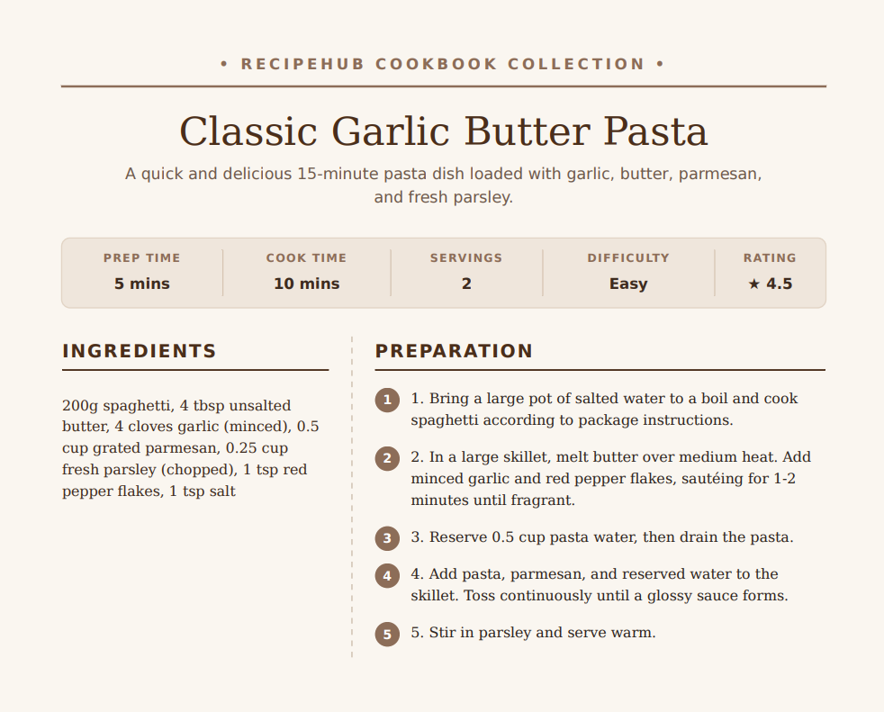
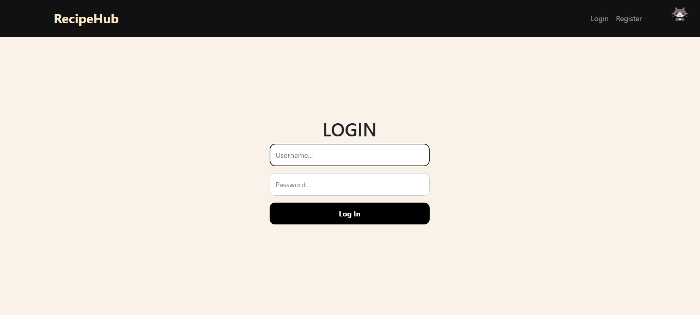

<div align="center">

# RecipeHub

Create, search, save, and share recipes.

[](https://www.python.org/)
[](https://flask.palletsprojects.com/)
[](https://www.sqlite.org/)
[](https://getbootstrap.com/)
[](https://cs50.harvard.edu/x/)
[](LICENSE)

[Video Demo](https://www.youtube.com/watch?v=v-dPzSHnuos) · [Features](#features) · [Screenshots](#screenshots) · [Getting Started](#getting-started) · [Routes](#routes-reference) · [Database](#database-design)

</div>

---

## Description

RecipeHub is a Flask web app built as a final project for Harvard's CS50x. It lets users register, log in, add recipes with images, search by title, favorite and rate recipes, and download any recipe as a formatted PDF.

---

## Features

| | |
|---|---|
| Auth | Hashed passwords (Werkzeug) + server-side sessions (Flask-Session) |
| Recipes | Add/edit with image upload, ingredients, instructions, times, servings, difficulty, category |
| Search | Title search with horizontal-card results |
| Favorites | Toggled instantly via `fetch()`, no page reload |
| Ratings | 5-star widget, live average updates via AJAX |
| Servings scaler | Ingredient quantities rescale automatically, with fraction formatting |
| Share | Web Share API with clipboard fallback |
| PDF export | Recipe rendered to a styled PDF via WeasyPrint |

---

## Screenshots

Drop your own screenshots into `docs/images/` using the filenames below — they render automatically.

<table>
<tr>
<td width="50%">

**Home**
<br>


</td>
<td width="50%">

**Search Results**
<br>


</td>
</tr>
<tr>
<td width="50%">

**Recipe Detail**
<br>


</td>
<td width="50%">

**My Recipes**
<br>


</td>
</tr>
<tr>
<td width="50%">

**Add Recipe**
<br>


</td>
<td width="50%">

**Favorites**
<br>


</td>
</tr>
<tr>
<td width="50%">

**PDF Export**
<br>


</td>
<td width="50%">

**Login / Register**
<br>


</td>
</tr>
</table>

---

## Technologies Used

Backend: Python, Flask, SQLite, CS50 SQL Library, Flask-Session, Werkzeug
PDF generation: ReportLab, WeasyPrint
Frontend: HTML, CSS, Bootstrap 5, vanilla JavaScript, Font Awesome

---

## Getting Started

### Prerequisites
- Python 3.11+
- pip

### Installation

```bash
git clone https://github.com/<your-username>/recipehub.git
cd recipehub

python3 -m venv .venv
source .venv/bin/activate      # Windows: .venv\Scripts\activate

pip install -r requirements.txt
```

> WeasyPrint needs system libraries (Pango, Cairo, GDK-PixBuf). On Debian/Ubuntu:
> `sudo apt-get install libpango-1.0-0 libpangocairo-1.0-0 libgdk-pixbuf2.0-0 libcairo2`
> See the [WeasyPrint install docs](https://doc.courtbouillon.org/weasyprint/stable/first_steps.html#installation) for macOS/Windows.

### Run

```bash
flask run
```

Visit `http://127.0.0.1:5000`. `recipes.db` already has the schema set up — register a new account to get started.

---

## Routes Reference

| Method | Route | Auth | Description |
|---|---|:---:|---|
| `GET` | `/` | – | Home page with search bar |
| `GET/POST` | `/search` | – | Search recipes by title |
| `GET/POST` | `/add` | Yes | Add a new recipe |
| `GET` | `/myrecipes` | Yes | Recipes created by the logged-in user |
| `GET/POST` | `/login` | – | Log in |
| `GET/POST` | `/register` | – | Create an account |
| `GET` | `/logout` | Yes | Clear the session |
| `GET` | `/recipe/<id>` | Yes | View a recipe, its rating, favorite status |
| `GET/POST` | `/edit/<id>` | Yes | Edit a recipe you own |
| `POST` | `/delete/<id>` | Yes | Delete a recipe you own (cascades ratings + favorites) |
| `POST` | `/favorite/<recipe_id>` | Yes | Toggle favorite — `204` for AJAX, or redirect back to search |
| `GET` | `/favorites` | Yes | Grid of favorited recipes |
| `POST` | `/rate/<id>` | Yes | Submit/update a rating — returns JSON `{ average, total }` |
| `GET` | `/download/<recipe_id>` | – | Render and stream the recipe as a PDF |

---

## How the AJAX Interactions Work

Favoriting and rating don't trigger a page reload — both `recipe.html` and `my_recipes.html` call the API with `fetch()` and patch the DOM from the response:

```
┌──────────────┐   fetch POST /rate/<id>   ┌──────────────┐   UPDATE / INSERT   ┌──────────────┐
│  recipe.html  │ ─────────────────────────▶│  rate(id)     │────────────────────▶│  ratings.db  │
└──────────────┘                            └──────┬───────┘                     └──────────────┘
       ▲                                            │  SELECT AVG(rating), COUNT(*)
       │        JSON { average: "4.3", total: 12 }  ▼
       └───────────────────────────────  { average, total }
                repaint stars + rating count live
```

The favorite heart follows the same pattern, but the server returns `204 No Content` — the client toggles the icon class (`fa-regular` ↔ `fa-solid`) locally.

---

## Project Structure

```
recipehub/
├── app.py                  # Flask app: routes, auth, PDF export, all SQL queries
├── recipes.db              # SQLite database (users, recipes, favorites, ratings)
├── requirements.txt        # Python dependencies
├── templates/
│   ├── layout.html         # Shared navbar + base layout
│   ├── index.html          # Home page with search bar
│   ├── login.html / register.html
│   ├── search.html         # Search results (horizontal cards)
│   ├── recipe.html         # Recipe detail: rating, share, servings scaler
│   ├── add_recipe.html / edit_recipe.html
│   ├── my_recipes.html     # Logged-in user's own recipes
│   ├── favorites.html      # Favorited recipes grid
│   ├── recipe_pdf.html     # Standalone template rendered to PDF
│   └── errors.html
├── static/
│   ├── style.css
│   └── uploads/             # User-uploaded recipe images
└── docs/
    └── images/               # Banner + screenshots used in this README
```

---

## Database Design

Four tables. `favorites` and `ratings` are join tables keyed on `(user_id, recipe_id)`, so many users can independently favorite or rate the same recipe.

```
┌────────────────────┐        ┌──────────────────────────────┐
│       users          │        │            recipes            │
├────────────────────┤        ├──────────────────────────────┤
│ id            PK     │───┐    │ id                    PK      │
│ username      TEXT   │   └───▶ user_id               FK →users│
│ hash          TEXT   │        │ title                 TEXT    │
└────────────────────┘        │ description           TEXT    │
         ▲   ▲                  │ ingredients           TEXT    │
         │   │                  │ instructions          TEXT    │
         │   │                  │ image                 TEXT    │
         │   │                  │ prep_time / cook_time INT     │
         │   │                  │ servings              INT     │
         │   │                  │ difficulty            TEXT    │
         │   │                  │ category              TEXT    │
         │   │                  └───────────────┬────────────────┘
         │   │                                  │
         │   └──────────────────┐               │
         │                      │               │
┌────────┴───────────┐  ┌───────┴────────────────┴─┐
│     favorites         │  │          ratings          │
├─────────────────────┤  ├──────────────────────────┤
│ user_id     FK →users │  │ user_id      FK →users    │
│ recipe_id   FK →recipes│ │ recipe_id    FK →recipes  │
└─────────────────────┘  │ rating       INT (1–5)    │
                            └──────────────────────────┘
```

| Table | Key columns | Notes |
|---|---|---|
| `users` | `id`, `username`, `hash` | Passwords stored only as Werkzeug hashes |
| `recipes` | `id`, `user_id`, `title`, `ingredients`, `instructions`, `image`, `prep_time`, `cook_time`, `servings`, `difficulty`, `category` | One row per recipe, owned by its creator |
| `favorites` | `user_id`, `recipe_id` | Existence of a row = favorited |
| `ratings` | `user_id`, `recipe_id`, `rating` | Unique per user/recipe pair; aggregated on read |

Deleting a recipe removes its `ratings` and `favorites` rows first, then the `recipes` row.

---

## Design Decisions

- Horizontal recipe cards instead of plain tables — more room for images and descriptions.
- Client-side servings scaler — ingredient quantities are rescaled in the browser with a regex + fraction formatter:

  ```
  Base (4 servings)          Tap "+" → 6 servings
  ─────────────────────      ─────────────────────
  2 cups flour        ──▶    3 cups flour
  250 g butter         ──▶   375 g butter
  1/2 tsp salt          ──▶  3/4 tsp salt
  ```

  Grams/ml round to whole numbers; cup/tbsp/tsp quantities snap to the nearest common fraction (1/4, 1/3, 1/2, 2/3, 3/4).

- AJAX favorites and ratings — both use `fetch()` so the page never reloads.
- Hashed passwords + server-side sessions.
- Separate PDF template (`recipe_pdf.html`) with its own cookbook-style typography via WeasyPrint.

---

## Future Improvements

- Advanced filtering by category and difficulty
- User profile pages
- Recipe edit history
- Nutritional information
- Recipe recommendations
- Comments and reviews
- Meal planning

<div align="center">

Built as a final project for [CS50x](https://cs50.harvard.edu/x/)

</div>
